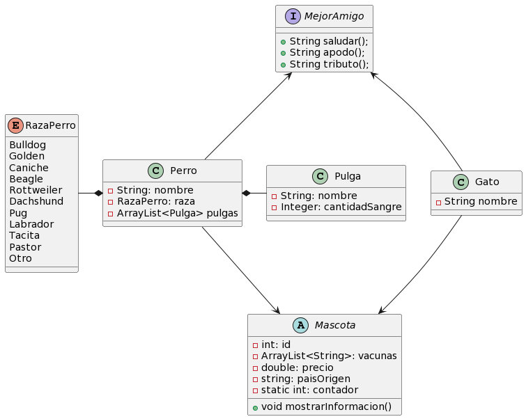

# Miniproyecto1
# _Integrantes_
- Alex Garcia Castañeda - 2259517
- Yessica Fernanda Villa Nuñez - 2266301
- Victor Manuel Hernandez Ortiz - 2259520

**Link de trello - espacio de gestion del proyecto**
 https://trello.com/invite/b/hlNTitaN/ATTId42c261a980fdd19d1d0d3af1603b5ffDEED9680/miniproyecto-i
# _Enunciado del miniproyecto_
Vamos a realizar una veterinaria a traves de un menu por consola con las siguiente opciones:
1. Insertar mascota
2. Actualizar mascota
3. Eliminar mascota
4. Buscar mascota por nombre
5. Listar todas las mascotas

Una mascota puede ser gato o perro, siguiendo una estructura similar a la que tiene el proyecto
base. Las mascotas tienen además de los atributos propios de cada animal, tienen cuántas
vacunas se les ha aplicado, cuanto cuestan y el país de origen.

Luego de gestionar las mascotas se abrirá un menú donde el usuario podrá seleccionar alguna
de estas opciones funcionales:

1. Qué mascotas tienen la vacuna malota
2. Cual es el top 5 de las mascotas más costosas.
3. Que mascotas no tienen país de origen en latinoamérica.
## _Diagrama de clases del proyecto que hemos planteado_

## _Descripcion geneal del funcionamiento del programa_
El presente proyecto es una veterinaria a través de un menu de consola, en donde se pueden interactuar con mascota como gatos o perros dependiendo de la elección del usuario, cada mascotas tiene sus propios atributos como el nombre, precio, razas en el caso del perro, vacunas y pais de origen. Para manipular todos los datos de estas mascotas se tiene un menu con varias opciones que nos ayudaran a interactuar con la veterinaria, existen métodos como insertar mascotas, actualizar mascotas, eliminar mascotas, buscar mascotas por nombre y listar todas las mascotas, a parte de este menu de manejo de datos de las mascotas, se tiene un submenu para estadísticas, como saber que mascotas tiene la vacuna malota, cual es el top 5 de las mascotas mas costosas, o saber que mascotas no tienen pais de origen en Latinoamérica.

## _Descripcion del funcionamiento de las funciones princiapales_
### Insertar mascotas
En este método se le pedirá al usuario que tipo de mascota quiere agregar si un perro o un gato, dependiendo de su elección se le pedirá que ingrese los parámetros del perro o del gato, algunos de los parámetro son nombre, precio, raza en el caso del perro, pais de origen y que vacunas tienen, todos los datos de cada mascota serán una posición en el array principal llamado que es el que almacena todas las mascotas, asi mismo se crearan mascotas por defecto en el main con el objetivo de agilizar procesos al probar los métodos posteriores.
### Actualizar mascota
Esta función permite al usuario actualizar alguna de las mascotas que se encuentran almacenadas en el programa. Primero pedimos al usuario el nombre, mediante este se verifica si la mascota existe en el programa y también se verifica de que tipo es esta mascota en caso de que exista. Posteriormente se hace un casteo de el objeto Mascota a un objeto sea Perro o Gato dependiendo de la verificación inicial. Posteriormente pedimos los datos nuevos, haciendo uso de variables, y luego usamos los setters de la clase para modificar los atributos del objeto por unos los nuevos atributos ingresados.

### Eliminar mascota
En este método se le pedirá al usuario que digite el nombre de la mascota que desea eliminar a continuación se imprimirán los datos de esa mascota es si que esta existe, y se le hara la pregunta al usuario con base a los datos en pantalla si esta seguro de querer eliminar la mascota, en el caso de que sea si, se procederá a eliminar la posición en el array apuntada por el nombre de la mascota que dio el usuario.

### Buscar mascota por nombre
Este método le pedirá al usuario que digite el nombre de la mascota que desea buscar, entonces la función va a iterar sobre el array de las mascotas y va comprobar mediante un ciclo for uno por los nombres de las mascotas comparando con el nombre digitado por el usuario y en caso de que el nombre sea igual al digitado por el usuario, se imprimirá en pantalla los datos de la mascota con ese nombre, y en caso que el nombre de la mascota no exista se imprimirá un mensaje diciendo que el nombre de las mascota no existe.

### Listar todas las mascotas
Esta función permite listar las mascotas que existen en el programa. La función hace uso del ciclo foreach recorriendo la lista de mascotas y exrayendo el objeto de cada posición, con este objeto llama al metodo mostraInformacion() el cual tiene un formato predefinido para mostrar todos los datos.  

### Que mascotas tienen la vacuna malota
Este método permite comprobar que mascotas tienen la vacuna malota, la función recorre todas las macotas y en cada mascota recorre los nombres de la vacunas de esta misma, y comprueba una por mi si alguna de las vacunas de las mascota es la vacuna malota, en caso de que así sea se imprimirá la información de la mascota, y en el caso de que no, se imprimirá que no hay ninguna mascota con la vacuna malota.

### Top 5 de las mascotas más costosas
Esta función muestra el top 5 de las mascotas más costosas y lo muestra en consola. Primero se crea un arraylist al cual se le añaden los datos que contiene el array donde se guardan las mascotas del programa. Posteriormente a este array creado (el cual no esta ordenado) le ordeno de mayor a menor por precio de mascota, haciendo uso de la clase Collections y su función sort con un reverseOrder, de esta manera el arrayList se ordena por el precio y este arrayList es el que muestro en pantalla haciendo uso de un foreach con la funcion mostrarInformacion() de los objetos. Lo anterior se puede implmentar gracias a que se añade la implementación de la interface Comparable dentro de la clase mascota, la cual cuenta con un metodo llamado compareTo al cual le doy el precio para que despues realice la comparacion y con ello el ordenamiento.

### Que mascotas no tienen origen latinoamericano
En este método se crea un arrayList con todos los paises latinoamericanos con el objetivo de comparar mediante la iteración de un for, el atributo de pais de origen de las mascotas con el array de los paises de Latinoamérica, entonces si en la iteración se encuentra que el pais de origen de la mascota es igual a alguno del array se descarta porque entonces seria latinoamericano, pero si no se encuentra ninguna equivalencia, se de por hecho que no tiene origen latinoamericano, y se imprimirían en pantallas las mascotas que cumplen con lo dicho anteriormente.